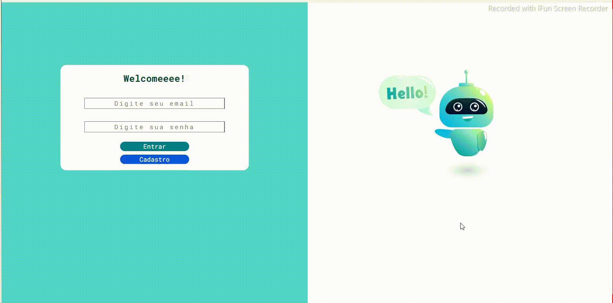
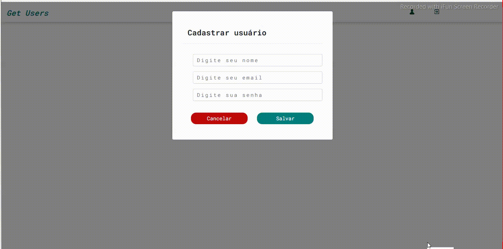
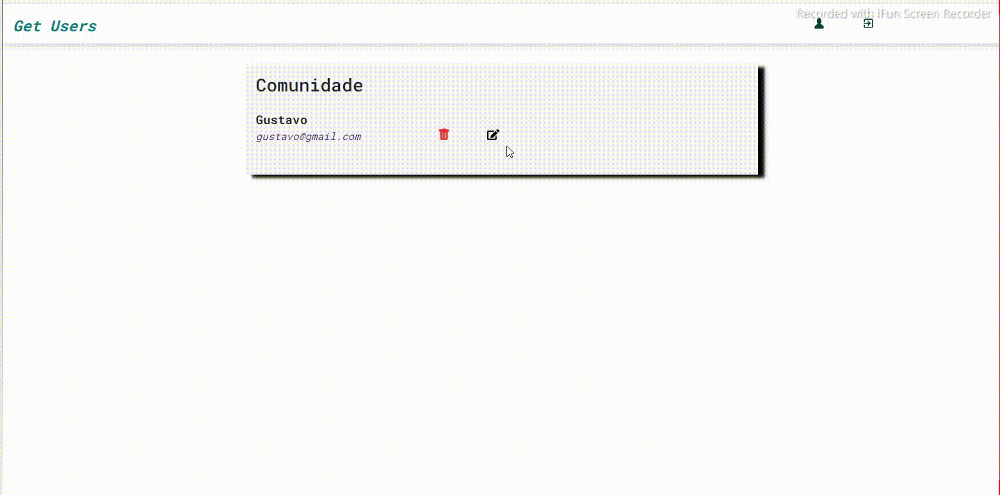
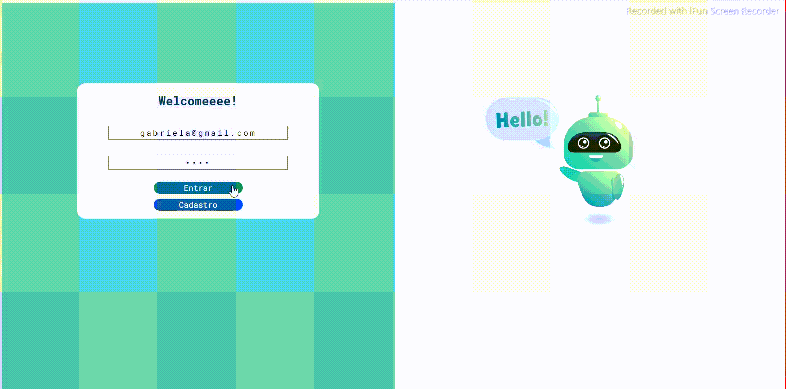
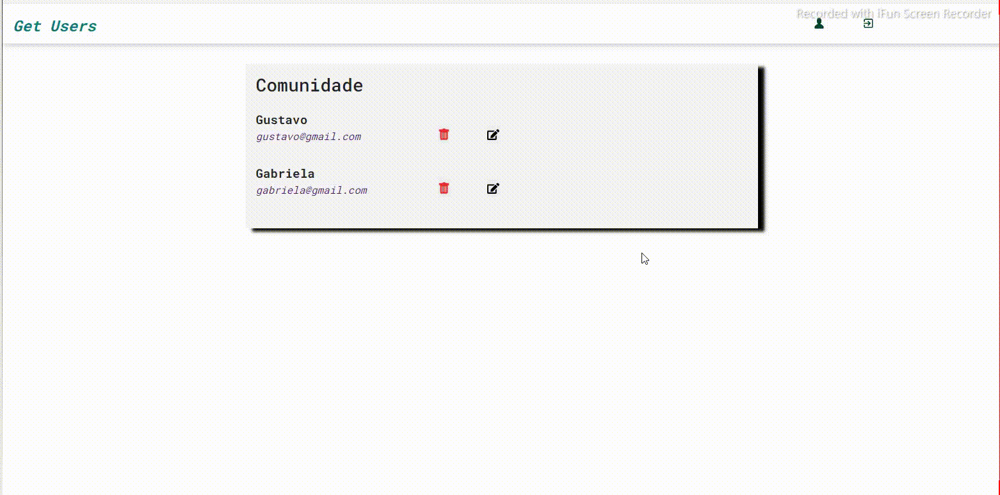
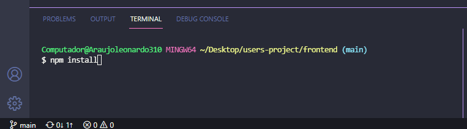
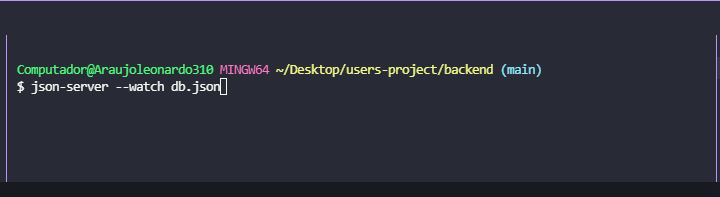
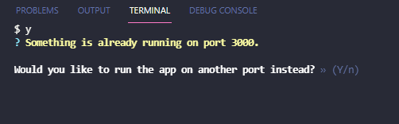

<h1>Projeto: Users Login 🙍‍♂️📱</h1>

INDICE

 

    <a href="#objetivo" align=center>Objetivo</a>&nbsp;&nbsp;&nbsp;
    <a href="#status" align=center>Status</a>&nbsp;&nbsp;&nbsp;
    <a href="#veja" align=center>Veja o projeto</a>&nbsp;&nbsp;&nbsp; 
    <a href="#instrucoes" align=center>Instruções de instalação</a>&nbsp;&nbsp;&nbsp;
    <a href="#recursos" align=center>Linguagens & Ferramentas</a>&nbsp;&nbsp;&nbsp;
    <a href="#skills" align=center>Skills</a>&nbsp;&nbsp;&nbsp;
    <a href="#autor" align=center>Autor</a> 

 

<h3 id="objetivo">Objetivo: realizar acesso, cadastro, alterações, visualização/consulta e delete de usuário(s)</h3>

 

<h3 id="status">Status</h3> 

***Concluíndo*** 🚀💻

 

<h3 id="veja">Veja o projeto 😊</h3>

    <h4> Page Login </h4>
    
     
    <h5> Page Cadastro </h5>
    
     
    <h5> Page Edição </h5>
    
     
    <h5> Page acesso </h5>
    
    <h5> Delete de usuário(s)</h5>
    

 

<h3 id="instrucoes">Instruções para rodar o projeto na sua máquina</h3>

1 - Faça fork (clone) do projeto

2 - Abra dois terminais.

3 - Um terminal deve estar dentro da pasta frontend, e o outro na backend

4 - Na pasta frontend, instale o package “node_module” com o comando ***npm install***

 

 

5 - Depois de instalado o package, digite no terminal da pasta backend o comando ***json-server --watch db.json***

 

 

6 - Volte para o terminal da pasta frontend e digite o comando npm start ou yarn start (caso tenha o yarn instalado)

 

>Aparecerá uma mensagem padrão no terminal frontend e, ela lhe perguntará se você aceita mudar o endereço da aplicação. 

 

7 - Digite “***s ou y***” para aceitar ou “***n***” para desistir.

 

 

<h3 id="recursos">Linguagens / framewoks / Bibliotecas / Ferramentas utilizadas</h3>

 

* React.js
* Javascript
* CSS
* HTML
* React Bootstrap
* React Icons
* React Toast
* Json-Server NPM (banco de dados em servidor local)
* Axios NPM (cadastro, alteração, deletação, busca e retorno de dados de API)
* LottieFiles (para animações)
* React Routes

 

<h2 id="skills">Skills obtidas com esse projeto</h2>

 

* ✔️ Primeiras noções de funcionamento e criação de um app com react
* ✔️ Noções de userStates
* ✔️ Desestruturação de objetos e arrays
* ✔️ Noções de servidor
* ✔️ Noções de rotas de endereços
* ✔️ Noções de componentes
* ✔️ Práticas de programação
* ✔️ Manipulação de elementos root do React
* ✔️ Noções de arrow functions 
* ✔️ Noções de map e filter

 

<h3 id="autor">Autor</h3> 

 Meu nome é Leonardo, mas gosto de ser o Leo. Estou me graduando em Sistemas de Informação. Sou Desenvolvedor Front-End (estagiário) na AjaxTI.
 

<h3 align=center><i>Gostos e Hobbies </i>📖🙋‍♂️</h3>  

Caminhar, correr, ciclismo, exercícios físicos, estudar, ler e aprender sobre desenvolvendo de sites e aplicações.
 

    <h3><strong>Contatos</strong></h3>
     
    
    &nbsp;&nbsp;&nbsp;&nbsp;&nbsp;&nbsp;&nbsp;&nbsp;&nbsp;
     
    &nbsp;&nbsp;&nbsp;&nbsp;&nbsp;&nbsp;&nbsp;&nbsp;&nbsp;
       
    &nbsp;&nbsp;&nbsp;&nbsp;&nbsp;&nbsp;&nbsp;&nbsp;&nbsp;
    

